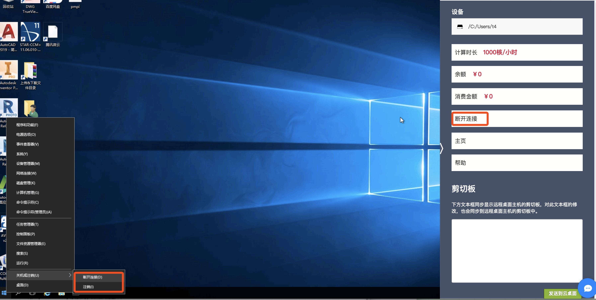

# 断开和注销

#### 断开连接有两种方式

1. 点击云桌面“菜单”按钮，点击“断开连接”；
2. 点击云桌面左下角windows按钮，选择“断开连接”。

#### 注销的方式

点击云桌面左下角windows按钮，选择“注销”


注销有时间可以解决c盘空间过大的问题，因为软件前后处理的时候会产生大量的临时文件在用户的appdata/local目录下面，注销后将会清理这些文件。


